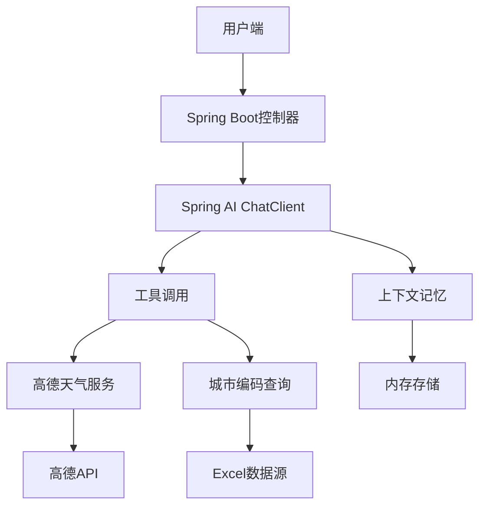
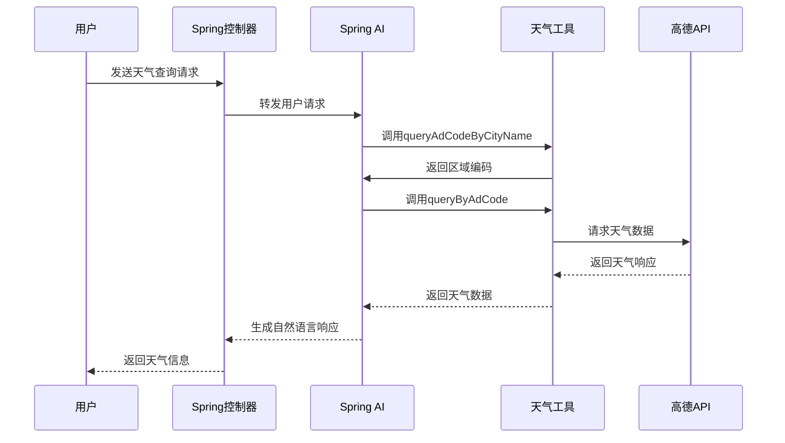

# SpringBoot AI MCP 1.0 集成高德天气预报完整方案

本文将介绍如何使用 Spring AI 1.0.0 Release 版本深度集成高德天气预报服务，提供完整的、可直接部署的解决方案。相较于网上不完整的示例，本项目已解决所有依赖版本问题和代码实现细节

---

## 技术架构概览



## 核心依赖配置

```xml
<!-- Spring AI BOM 管理 -->
<dependencyManagement>
    <dependencies>
        <dependency>
            <groupId>org.springframework.ai</groupId>
            <artifactId>spring-ai-bom</artifactId>
            <version>1.0.0</version>
            <type>pom</type>
            <scope>import</scope>
        </dependency>
    </dependencies>
</dependencyManagement>

<!-- 主要依赖 -->
<dependencies>
    <dependency>
        <groupId>org.springframework.boot</groupId>
        <artifactId>spring-boot-starter-webflux</artifactId>
    </dependency>
    <dependency>
        <groupId>org.springframework.ai</groupId>
        <artifactId>spring-ai-client-chat</artifactId>
    </dependency>
    <dependency>
        <groupId>org.springframework.ai</groupId>
        <artifactId>spring-ai-starter-model-openai</artifactId>
    </dependency>
    <dependency>
        <groupId>org.springframework.ai</groupId>
        <artifactId>spring-ai-autoconfigure-model-chat-client</artifactId>
    </dependency>
    <dependency>
        <groupId>org.springframework.ai</groupId>
        <artifactId>spring-ai-starter-mcp-server-webflux</artifactId>
    </dependency>
    <dependency>
        <groupId>org.projectlombok</groupId>
        <artifactId>lombok</artifactId>
    </dependency>
    <dependency>
        <groupId>cn.idev.excel</groupId>
        <artifactId>fastexcel</artifactId>
        <version>${fastexcel.version}</version>
    </dependency>
</dependencies>
```

## 核心组件实现

### 1. AI配置中心

```java
@Configuration
public class ChatClientConfig {

    // 配置基于时间窗口的对话记忆
    @Bean
    public MessageChatMemoryAdvisor messageWindowChatMemory() {
        ExpireMemoryRepository memoryRepository = new ExpireMemoryRepository();
        MessageWindowChatMemory chatMemory = MessageWindowChatMemory.builder()
                .chatMemoryRepository(memoryRepository)
                .maxMessages(20) // 保留最近20条对话
                .build();

        return MessageChatMemoryAdvisor.builder(chatMemory)
                .scheduler(Schedulers.parallel())
                .build();
    }
    
    // 配置ChatClient
    @Bean
    public ChatClient chatClient(ChatClient.Builder builder, 
                               ToolCallbackProvider toolCallbackProvider,
                               MessageChatMemoryAdvisor messageChatMemoryAdvisor) {
        
        return builder
                .defaultSystem("""
                    你是一个地理专家和天气预报助手，可以帮助用户查询天气预报信息。
                    工作流程：
                    1. 根据用户地址信息匹配到标准行政区划的区县级名称
                    2. 根据区县名称获取区域编码
                    3. 使用区域编码查询天气预报
                    4. 整理天气信息并提供出行建议
                    """)
                  // 工具调用
                .defaultToolCallbacks(toolCallbackProvider) 
                 // 对话记忆
                .defaultAdvisors(messageChatMemoryAdvisor) 
                .build();
    }
}
```

### 2. 高德天气服务集成

```java
@Slf4j
@McpService
public class WeatherInfoService {
    
    @Resource
    private AmapConfigProperties amapConfigProperties;
    
    private Map<String, CityModel> cityModels;
    
    // 初始化城市编码数据
    @PostConstruct
    public void init() {
        try (InputStream mapCityIo = getClass().getResourceAsStream("/xlsx/AMap_adcode_citycode.xlsx")) {
            CommonDataListener<CityModel> dataListener = new CommonDataListener<>();
            FastExcel.read(mapCityIo)
                    .sheet()
                    .head(CityModel.class)
                    .registerReadListener(dataListener)
                    .doRead();
            this.cityModels = dataListener.getList().stream()
                    .collect(Collectors.toMap(CityModel::getCityName, 
                                            Function.identity(),
                                            (t, t2) -> t));
        } catch (IOException e) {
            throw new RuntimeException("加载城市编码数据失败", e);
        }
    }
    
    // 工具方法：根据城市名查询区域编码
    @Tool(name = "queryAdCodeByCityName", 
          description = "根据区县名称获取区域编码")
    public Optional<String> queryAdCodeByCityName(
            @ToolParam(description = "区县名称") String cityName) {
        
        log.info("查询城市编码: {}", cityName);
        return Optional.ofNullable(cityModels.get(cityName))
                .map(CityModel::getAdCode);
    }
    
    // 工具方法：根据区域编码查询天气
    @Tool(name = "queryByAdCode", 
          description = "根据区域编码查询天气预报")
    public WeatherResponse queryByAdCode(
            @ToolParam(description = "区域编码") String adCode) {
        
        log.info("查询天气信息，区域编码: {}", adCode);
        
        return WebClient.builder()
                .baseUrl(amapConfigProperties.getUrl())
                .build()
                .get()
                .uri(uriBuilder -> uriBuilder.path("/v3/weather/weatherInfo")
                        .queryParam("key", amapConfigProperties.getKey())
                        .queryParam("city", adCode)
                        .queryParam("extensions", "all")
                        .build())
                .retrieve()
                .onStatus(HttpStatusCode::isError, response -> 
                    Mono.error(new ServiceException("高德天气服务异常")))
                .bodyToMono(WeatherResponse.class)
                .block();
    }
}
```

### 3. 控制器实现

```java
@RestController
@RequestMapping("/api/chat")
@Slf4j
public class ChatController {
    
    @Resource
    private ChatClient chatClient;
    
    // SSE流式响应（适合前端实时展示）
    @PostMapping(value = "stream", produces = MediaType.TEXT_EVENT_STREAM_VALUE)
    public Flux<ChatResponse> chatStream(@RequestBody ChatRequest request) {
        return chatClient.prompt()
                .user(request.getMessage())
                .advisors(advisor -> {
                    if (request.getConversationId() != null) {
                        advisor.param("chat_memory_conversation_id", 
                                      request.getConversationId());
                    }
                })
                .stream()
                .content()
                .map(ChatResponse::new)
                .onErrorResume(e -> Flux.just(
                    new ChatResponse("服务处理异常: " + e.getMessage(), false)));
    }
    
    // 阻塞式响应（适合API调用）
    @PostMapping("blocking")
    public Mono<ChatResponse> chatBlocking(@RequestBody ChatRequest request) {
        return chatClient.prompt()
                .user(request.getMessage())
                .advisors(advisor -> {
                    if (request.getConversationId() != null) {
                        advisor.param("chat_memory_conversation_id", 
                                      request.getConversationId());
                    }
                })
                .call()
                .content()
                .map(ChatResponse::new)
                .onErrorResume(e -> Mono.just(
                    new ChatResponse("服务处理异常: " + e.getMessage(), false)));
    }
}
```

### 4. 配置文件示例

```yaml
server:
  port: 8080

amap:
  key: ${AMAP_KEY:your_amap_key}  # 高德开放平台KEY
  url: https://restapi.amap.com

spring:
  application:
    name: weather-ai-service
  ai:
    openai:
      api-key: ${OPENAI_API_KEY:your_api_key}
      base-url: ${OPENAI_BASE_URL:https://api.deepseek.com} # DeepSeek兼容URL
      chat:
        options:
          model: deepseek-chat  # 使用DeepSeek模型
          temperature: 0.7
          max-tokens: 2000
```

## 系统工作流程



## 使用示例与效果

### 1. 请求示例

```json
POST /api/chat/blocking
{
  "message": "北京海淀区明天的天气如何？",
  "conversationId": "conv_123456"
}
```

### 2. AI工具调用过程

```log
INFO WeatherInfoService     : 查询城市编码: 海淀区
INFO WeatherInfoService     : 查询天气信息，区域编码: 110108

```

### 3. 响应结果

```json
{
    "content": "海淀区明天的天气预报如下：\n\n- **日期**: 2025年06月05日（星期四）\n- **白天天气**: 多云\n- **夜间天气**: 晴\n- **白天温度**: 36°C\n- **夜间温度**: 22°C\n- **风向**: 西南风\n- **风力**: 1-3级\n\n### 出行建议\n1. **防晒**: 白天温度较高，注意防晒，避免长时间暴露在阳光下。\n2. **补水**: 高温天气容易导致脱水，记得多喝水。\n3. **夜间温差**: 夜间温度较低，建议携带一件薄外套。\n\n如果需要更详细的天气信息或其他帮助，请随时告诉我！",
    "success": true
}
```


## 项目资源

- **GitHub地址**：  
  [https://github.com/dingdaoyi/spring-mcp-demo](https://github.com/dingdaoyi/spring-mcp-demo)

### 参考

https://docs.spring.io/spring-ai/